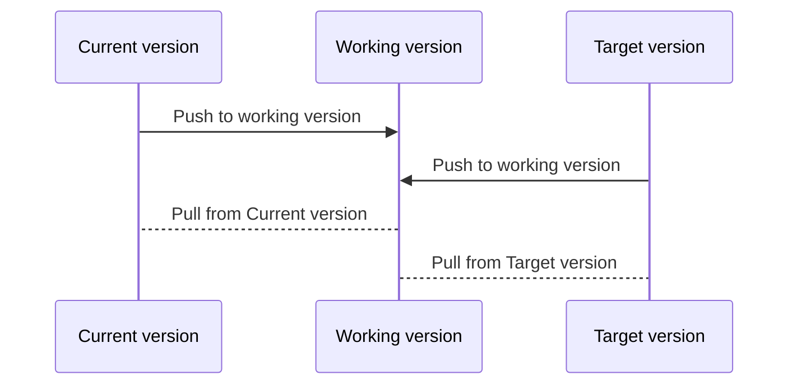
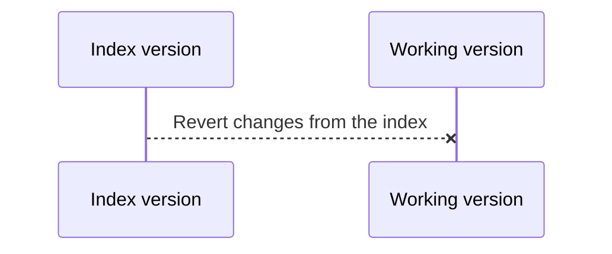

[My Vim Keybindings](My%20Vim%20Keybindings.md)

```bash
     ___________ - Written By Julian Insua
    /__  ___  __/ - Stolen from many others
      / /  / /    - File:
 __  / /  / /     - Date:
/ /_/ /__/ /__    - Comments:
\____/_______/    -
```

# Insert Mode

Insert mode lets you type, all the keys have their default values

## Exit

- `Esc`: exit insert mode

## Enter Insert mode

- `i`: enter insert mode in the current cursor
- `a`: enter insert mode to spend to where the current cursor is (next caracter)
- `o`: open a new line below and enter insert mode
- `I`: enter insert mode at the beginning of the current line
- `A`: enter insert mode at the end of the current line
- `O`: Open a new line above and enter insert mode
- `cc`: delete the content of a line and enter insert mode

## Actions

- `Ctrl+r`: Gives you access to registers. If you want to paste whatever's 8n register `0` then you can do `Ctrl+r 0` to paste it directly. This also works in the same way in command mode.

# Visual mode

Visual mode lets you select stuff visually, moving the cursor will automatically select lines of text from the point where you entered visual mode.

## Enter

- `v`: enter visual mode on the current cursor.
- `V`(`Shift+v`): enter line visual mode. (Only lines are selected)
- `Ctrl+v`: enter block visual mode. you can select lines and columns and apply all your vim magic to them. You can only select squares.

## Exit

- `Esc Esc`: exit visual mode to normal mode (if nothing is selected, then only one `Esc` will do)

## Edit

All commands can be prepended by a number to repeat the command as many times. if you want to copy 5 lines you can do `5yy` and you get 5 lines copied (yanked). Then `5p` pastes them 5 times, an so on and so forth

- `u`: undo
- `ctrl+r`: redo
- `d`: is the command to delete the selected text. Also by deleting with this command we copy what we deleted. In other words, deleting is the equivalent to cutting in Vim.
- `D`(`Shift+d`): delete from the cursor to the end of the line
- `dd`: delete line
- `y`: copy the selected text (`y` is supposed to come from yank, or yanking)
- `yy`: copy the full line of text (again, `y` is short for yanking)
- `p`: paste what you yanked after the current cursor (if you yanked a whole line it will be inserted on the previous line, above)
- `P`(`Shift+p`): paste what you yanked before the current line (if you yanked a whole line it will be inserted on the following line, below)
- `“+y`: This copies what you are yanking to the system clipboard. The `“` lets you into the registers, the `+` register is the system clipboard and then you yank to it.
- `“+p`: This pastes whatever is on the system clipboard. The `“` lets you access the registers, the `+` register is the system clipboard and then you paste from it.
- `c`: delete the selected text and enter insert mode (`c` stands for change)
- `cc`: delete the line content and enter insert mode (`c` stands for change)
- `r`: replace the selected text for a character repeated as many times and enter normal mode
- `R`(`Shift+r`): delete the line content and enter insert mode (the same as `cc`)
- `>>`: indent right
- `<<`: indent left
- ` ==`: auto indent

## Movement

You can move the cursor in very specific ways

- `h`:←
- `j`: ↓
- `k`: ↑
- `l`:→
- `w`: jump to the beginning of the next word. Consider special characters as separate words (except underscore). Will stop between one-word, but not between one_word
- `W`(`Shift+w`): jump to the beginning of the next word. Only consider spaces as separators for words. Won’t stop between one-word or one_word.
- `e`: Jump to the end of the word, if you are at the end jump to end of the following word. Consider special characters as separate words (except underscore). Will stop between one-word, but not between one_word.
- `E`(`Shift+e`): Jump to the end of the word, if you are at the end jump to end of the following word. Only consider spaces as separators for words. Won’t stop between one-word or one_word.
- `b`: Jump to the beginning of the word, if you are at the beginning jump to beginning of the previous word. Consider special characters as separate words (except underscore). Will stop between one-word, but not between one_word.
- `B`(`Shift+b`) : Jump to the beginning of the word, if you are at the beginning jump to beginning of the previous word. Only consider spaces as separators for words. Won’t stop between one-word or one_word.
- `0`: beginning of the line
- `$`: end of the line
- `%`: while standing on a delimiter (parentehsys, quotation marks, brackets or curly braces) jumps to the opposite delimiter.
- `t<character>`: jumps to the character before the following appearance of the character.
- `T<character>`: jumps to the character after the previous appearance of the character.
- `f<character>`: jumps to the following appearance of the character entered.
- `F<character>`: jumps to the previous appearance of the character entered.
- `gg`: Beginning of the file
- `G`(`Shift+g`): end of the file
- `<number>G`: go to line `number`.

## Run

- `K`(`Shift+k`): enter the man page for the selected text. It’s equivalent to running `man <selected_text>`

### Helpful comands

- `:s/<word_to_search>/<word_to_replace>/g`: replace the word to search with the word to replace on the current selection , if nothing is selected it will work on the current line.
- `.`: repeat last comand.

# Normal mode

Normal mode lets you do stuff, every key has a function that does something special.

## Exit

- `:q`: exit (works if nothing changed)
- `:q!`: exit and discard changes
- `:wq`: write changes then exit
- `ZZ`: write changes and exit (quick!)

## Edit

- `u`: in normal mode Undo the last insertion
- `ctrl+r`: in normal mode redo last insertion
- `d`: is the command to delete something. Also by deleting with this command we copy what we deleted. In other words, deleting is equivalent to cutting in Vim.
- `dd`: delete line
- `D`(`Shift+d`): delete from the cursor to the end of the line
- `yy`: copy the full line of text (`y` is short for yanking)
- `Y`(`Shift+y`): copy the full line of text (`y` is short for yanking). The same as `yy`.
- `p`: paste what you yanked after the current cursor (if you yanked a whole line it will be inserted on the previous line, above)
- `P`(`Shift+p`): paste what you yanked before the current line (if you yanked a whole line it will be inserted on the following line, bellow)
- `cc`: delete the line content and enter insert mode (`c` stands for change)
- `C`(`Shift+C`): delete from the current cursor to the end of the line and enter insert mode. Change the text from the cursor to the end of the line.
- `s`: delete the current character and enter insert mode. “suppress”
- `S`: Delete the whole line and enter insert mode (properly indented) “Suppress”
- `r`: replace a character for an other without entering the insert mode
- `>>`: indent right
- `<<`: indent left
- `:reg`: Access registry list
- `“<registry_position>p`: paste the content in `<registry_position>`.

## Movement

You can move the cursor in very specific ways

- `h`:←
- `j`: ↓
- `k`: ↑
- `l`:→
- `w`: jump to the beginning of the next word. Consider special characters as separate words (except underscore). Will stop between one-word, but not between one_word
- `W`(`Shift+w`): jump to the beginning of the next word. Only consider spaces as separators for words. Won’t stop between one-word or one_word.
- `e`: Jump to the end of the word, if you are at the end jump to end of the following word. Consider special characters as separate words (except underscore). Will stop between one-word, but not between one_word.
- `E`(`Shift+e`): Jump to the end of the word, if you are at the end jump to end of the following word. Only consider spaces as separators for words. Won’t stop between one-word or one_word.
- `b`: Jump to the beginning of the word, if you are at the beginning jump to beginning of the previous word. Consider special characters as separate words (except underscore). Will stop between one-word, but not between one_word.
- `B`(`Shift+b`) : Jump to the beginning of the word, if you are at the beginning jump to beginning of the previous word. Only consider spaces as separators for words. Won’t stop between one-word or one_word.
- `0`: beginning of the line
- `$`: end of the line
- `%`: while standing on a delimiter (parentehsys, quotation marks, brackets or curly braces) jumps to the opposite delimiter. If no delimiter is under the cursor it will jump to the next delimiter.
- `*`: Next occurrence of the current word
- `#`: Previous occurrence of the current word
- `t<character>`: jumps to the position before the following appearance of `character`. You can repeat forward the command you just entered with `;` or backwards with `,`.
- `T<character>`: jumps to the position after the previous appearance of `character`.. You can repeat forward the command you just entered with `;` or backwards with `,`.
- `f<character>`: jumps to the following appearance of the character entered. “Fly” to the character. You can repeat forward the command you just entered with `;` or backwards with `,`.
- `F<character>`: jumps to the previous appearance of the character entered. “Fly” to the character. You can repeat forward the command you just entered with `;` or backwards with `,`.
- `gg`: Beginning of the file
- `G`(`Shift+g`): end of the file
- `<number>G`: go to line `number`.
- `:<number><Enter>`: go to line `<number>`
- `{`: go to previous empty line
- `}`: go to next empty line
- `Ctrl+u`: page up
- `Ctrl+d`: page down
- `gg=G`: auto indent the whole file. `gg` moves to the beginning of the file. ` =` autoindent edit comand. `G`, movement command to go to the end of the document
- `zz`: center the current line on the screen
- `z<Enter>`: scroll the current line to the top of the screen
- `zb<Enter>`: scroll the current line to the bottom of the screen

### Using marks

You can mark the page to quickly go back to a location:

- `m<mark_name>`: set the mark name as a character `<mark_name>`
- \``<mark_name>`: Go to the mark, exactly where you put it. This is a back tick
- `'<mark_name>`: Go to the beginning of the line of the mark you put. This is a single quote.

## Combining editing and movement

You can use editing commands with the movement commands. Also you can insert multipliers before the editing command or the movement comand to repeat the either the move or the whole thing as many times. Some useful examples ahead:

- `dw`: For short, delete a word. `d` stands for delete, `w` stands for word, so your editing command is to delete, and you delete everything before your jump to the next word. if you are in the middle of a word you will delete only the part from the cursor to the end of the word.
- `diw`: For short, delete inner a word. It deletes the whole word it doesn’t care where you are
- `di<delimiter>`: delete everything inside a `delimiter` (parenthesis, square brackets or curly braces)
- `da<delimiter>`: deleteEverything inside a `delimiter` and the delimiter itself (parenthesis, square brackets or curly braces)
- `dip`: delete inner paragraph. This will delete everything up until the next blank line and the same thing down.
- `dt<character>`: delete from where the cursor is until the character before the following `character`. It leaves the character alone. (useful for changing multi-line comments: `dt*`)
  This is particularly useful to delete everything inside parentheses, for example, then by typing `dt)` you delete everything until the next closing parenthesis but not including the parenthesis.
- `df<character>`: delete from here to the next `character`, `character` will be deleted.
- `ciw`: For short, change inner a word. It changes a whole word, meaning it deletes the word and enters insert mode.
- `ci<delimiter>`: change everything inside a `delimiter` (parenthesis, square brackets, curly braces, quotation marks). This will delete everything inside the delimiter and enter insert mode.
- `ca<delimiter>`: change everything inside a `delimiter` and the delimiter itself (parenthesis, square brackets or curly braces)
- `cap`: Change inner paragraph. This will delete everything up until the next blank line and the same thing down. Then it will enter insert mode.
- `ct<character>`: Delete from the current position up until the next occurrence of the `character` without deleting it. Then enter insert mode.
- `cf<character>`: Delete from the current position up until the next occurrence of the `character` and deleting it. Then enter insert mode.
- `yiw`: For short, yank inner word. This will copy (or yank) the word the cursor is in whiteout caring the position
- `yi<delimiter>`: Yank (copy) everything inside a `delimiter` (parenthesis, square brackets, curly braces, quotation marks)
- `ya<delimiter>`: Yank (copy) everything inside a delimiter and the delimiter itself (parenthesis, square brackets, curly braces, quotation marks)
- `yw`: For short yank a word. It copies from the current position till the end of the word
- `y2w`: For short yank two words. It copies from the current position till the end of the next word.
- `2yw`: it's the same that `y2w`
- `d$`: delete from cursor to the end of the line
- `d0`: delete from the cursor to the beginning of the line

## Searching

- `/<search_term>`: This will search for whatever you want inside the file. From top to bottom
- `?<search_term>`: This will search for whatever you want inside the file. From bottom to top
- `n`: jump to the next result of the search (in the direction of the search)
- `N`(`Shift+n`): jump to the previous result of the search (against the direction of the search)
- `*`: while standing with the cursor on a word it will make a search for the next iteration of that word. Ignores special characters as separators including underscore
- `#`: while standing with the cursor on a word it will make a search for the previous iteration of that word.Ignores special characters as separators including underscore

# Command mode

Always start with a colon (`:`)Each character or string has its meaning and you can combine them as you please:

- `:w`: Write the current buffer
- `:wa`: Write all files with changes on the tree
- `.`: repeat last comand.
- `%`: make the action on the whole file and not only in the current line
  - `:reg`: enter the registry (where everything we copy or paste is stored, also if we delete it using `d`, it’s copied)
- `:s`: substitute, make a replacement. sintax is `:s/<word_to_search>/<word_to_replace>`
- `:%s/<word_to_search>/<word_to_replace>/g`: replace the `<word_to_search>` with the `<word_to_replace>` on the whole document. Skipping the `%` makes it work on the current selection , if nothing is selected it will work on the current line
- `Ctrl+r`: lets you select the name of a register to paste it’s content on the command line
- `:so %`: This is short for source current file. In this command `:so` is a shorthand for `:source` and `%` indicates the current file. So if you are editing your `.vimrc` or `init.vim` you can reload it without closing using this command
- `:Ex`: Opens Vim’s native plugin for file exploring
- `:!<command>`: run a command on the terminal
- `Ctrl+r <registry>`: You can paste into the command line by using `Ctrl+r` (r for registry) and then entering the registry number you want to paste. The most common one is the system clipboard, that would be `Ctrl+r +`.

### Helpful stuff

- `yi<import_path_delimiter>:e <Ctrl+r>0<Tab>`: You can take advantage of this plugin to open on a buffer a given path with this sequence. `yi<delimiter>` gets the path to the file you are trying to import. The `:e` command will let you open a new buffer on a given file. `Ctrl+r` allows you to paste a register into the command line. 0 is the default register for the last thing you yanked. `Tab` triggers the autocompletion so that the extension gets filled out. After all that, pressing enter will open the file in a new buffer.

## Marking

- `m<lowercase_character>`: creates a mark with the `character` on the current line of the cursor.
- `'<lowercase_character>`: go to the mark previously created with the `character`.
- `m<uppercase_character>` (`m+Shift+<character>`): This makes a global mark. Wherever you are you can go back to that mark, even if you are on some other file.

# File Management

## Basic file opperations

- `:e <fuzzy_search_string>`: At any point you can hit tab and an option should be autocompleted for you. You can use `**` to specify any string, including multiple directories, etc.
- `:Ex`: You enter a file viewer (Netrw, it’s a plugin incorporated to vim)and you can open files from there using `<Enter>`
- `:e <relative_path>`: Opens the file in the path. Path is relative to the location where you ran your command to open vim or nvim.
- `:enew`: creates a new empty No Name buffer and opens it on the on the current window
- `:new`: creates a horizontal split with a new empty No Name buffer
- `:vnew`: creates a vertical split with a new empty No Name buffer

## Moving in history

- `Ctrl+^`(`Ctrl+Shift+6`): Toggles between the previous buffer and the current one. Once you have 2 files opened, you can go back and forward with this shortcut.
- `Ctrl+o`: Move Backwards on your history (this will include the times you pressed `{` or `}` or the times you went to the top of a file)
- `Ctrl+i`: Move Forward on your history (this will include the times you pressed `{` or `}` or the times you went to the top of a file)

## Split creation and navigation

### Creating and deleting splits

- `:vsplit <FILE_PATH>`: This will split the screen vertically and open the file on the new split. An empty path will split the
- `:split <FILE_PATH>`: This will split the screen horizontally and open the file on the new split
- `:q[uit]`: close the current split and the buffer associated.
- `Ctrl+w o`: keep the current split, close the rest.
- `Ctrl+w v`: Create a vertical split. It opens the same thing you are on.
- `Ctrl+w s`: Create a horizontal split. It opens the same thing you are on.

### Navigating splits

You can navigate your splits using `Ctrl+w`. Then you need to tell to which split you want to move relative to the split you are in. using the `h j k l` keys.

- `Ctrl+w h`: Move to the split left
- `Ctrl+w j`: Move to the split down
- `Ctrl+w k`: Move to the split up
- `Ctrl+w l`: Move to the split right

### Resizing splits

This will change the size of the split one unit, either a line or a column

- `Ctrl+w [SPLIT_NUMBER?] +`: increase the height of the current window. The split number is optional.
- `Ctrl+w [SPLIT_NUMBER?] -`: decrease the height of the current window. The split number is optional.
- `Ctrl+w [SPLIT_NUMBER?] <`: decrease the width of the current window. The split number is optional.
- `Ctrl+w [SPLIT_NUMBER?] >`: increase the width of the current window. The split number is optional.
- `Ctrl+w |`: Expand split vertically. Max number of columns
- `Ctrl+w  _`: Expand split horizontally. Max number of rows
- `Ctrl+w =`: Reset all splits to their default size
- `:resize <number>`: resizes your split to a `<number>` of rows.
- `:vertical resize <number>`: resizes your split to a `<number>` of columns.

## Tab creation and navigation

Tabs can save their own splits and buffers so that you can navigate from a view to another. Here's how to manage them.

### Create a new tab

To create a new tab run this command:

```bash
:tabnew
```

This will create a new tab on a no name buffer. If you want to open a particular file you can pass it as a parameter:

```bash
:tabnew ~/code/some_file.ts
```

You can also populate different tabs by opening vim with a `-p` flag:

```bash
vim -p file1 file2 file3
# or

nvim -p file1 file2 file3
```

If you want to find a file in your current file you can use the `tabf` command:

```bash
:tabf file*
```

This won't accept more that one result, you'll have to narrow down the search
If you want tab completion you can use `tabn`:

```bash
:tabn file1
```

### Navigating between tabs

To navigate between tabs you can use this commands:

```bash
# go to the next tab
:tabn

#go to the previous tab
:tabp

# go to the first tab
:tabfirst

# go to the last tab
:tablast
```

You can always see what tabs are open with:

```bash
:tabs
```

### Moving tabs around

If you’re meticulous and want to position tabs _just so_ in Vim, you can move the tabs to a specific spot in the tab order using:

```bash
:tabm n
```

where `n` is the position number that you want to use. If you don’t give the `:tabm` command an argument, then the current tab will be moved to the last spot.

> [!note] Important!
> Vim starts tab numbering from 0

# Configuration

## Vim config file

Access or create the config file by entering on a terminal:

```bash
vim ~/.vimrc
```

Then add the commands you would type on vim without the colon, a simple .vimrc is:

```bash
set number
set tabstop=2
set shiftwidth=2
set autoindent
set mouse=a
colorscheme delek
```

## Add line numbers

- Adding absolute numbers to each line: On normal mode write: `:set number`
- Adding relative numbers to each line (it gives you the current line number and every other line’s distance to the current line): `:set relativenumber`

## Macros and registers

### Registers

You can access a register of everything you yanked, pasted or deleted by using the `:reg` command. Once you hit Enter, you’ll see a list of the different stuff you yanked, etc. And a set of numbers prepended by a double quotation mark. You can chose to paste whatever you need from the registry by, instead of presing `p` directly, prepending the quotation mark and the number. for example, if you want to paste whatever is in register number seven, you’d need to type the command `"7p`.

You can also copy stuff into specific positions on the registry. for example if you want to yank a line into position 7, you can write the following command: `"7yy`.

#### Registers explained
You have a default registerthat's the no name register. every time you yank or delete whatever you yankeed or deleted goes there. Then youhave registers `0` and `1`. Every time you yank something, whatever it is you yanked it goes to the `0` register. Whatever you delete in visual mode also goes there. Only lines deleted go to register `1`. This is good to know if you yanked something, delete some lines and then pasete. You can access that yank in register `0` and the deleted part in register `1`. Subsequen deletions are pushed to registers `2`, `3` and so on and so forth. You can also use named registers. These are registers named by a letter.These are the same registers used by macros to store themselves.

#### Read only registers
There are some registers that are always available to you but you can never modify. These are read only registers. 6ere's a brief list of them:
- `%`: THis register holds the current file path from the current working directory.
- `:`: this register holds the last comand you ran on the command prompt.
- `#`: This holds the previous file you accessed relative to the current working directory.(This varies it's sometimes is absolute)
- `.`: Holds whateveryou inserted in your las insert mode insert.
- `/`: Holds your last search

#### Expression register 
You have your own calculator inside neovim. You only need to type `"=`. this will enter inside the expression register. You'll see an `=` on your comand prompt. Now You can write math expressions using common opperators and when you type `Enter`, you get the result directly on your default register. Some usefull stuff:
- `sqrt(number)`: square root
- `pow(number, exponent)`: make powers
- `log(number)`: Logarithm base e

Another very usefull use case for this is that you can store system comands like this directly to the default register. To do this use:
```

=system('shell command here')
=system('ls')
```

This will store a list of all your files on the current directory into your default register so that you can paste it directly.

#### Filename modifiers
You can modify the filename registers using modifiers. Here's a list:
- `%:p`: Makes a file's path absolute
- `%:h`: Stands for "head". It will give you everything before the filename
- `%:t`: Stands for "tail". It will give you filename and extension
- `%:r`: Stands for "root". It will give you the path minus the extension of the file, but will include the filename.
- `%:e`: Stands for "extension". It will give you only the extension of the file.

Check the help with `:h filename-modifiers`. There's a whole bunch of cool things, like making a path relative to home and other cool stuff.
### Using the system clipboard

the system clipboard is stored in a special register, the “plus” register. so every time you type this command `"+p` you will paste whatever is on your system clipboard.

If you want to paste the last thing you actually yanked, not the deleted stuff that got copied as a side effect, then you need to use register `"0p`.

### Macros

To record a macro on position `<character>`, just write the command `q<character>`. Whatever you do next will be recorded on the macro. To quit recording just type the `q` command alone and hit Enter. Now if you enter the register you will see that under the registry `"<character>` there’s the command that composes the macro.

Now to execute the macro just enter this command: `@<character>`. this will execute the macro.

Finally, you can create macros that execute other macros.

#### Editing macros 
If you realize your macro has a mistake you can edit it. To do this you first recor the macro, lets say in register `a`. To do this you type `qa`. Perform the operation you want to repeat, then press `q` to stop recording. Now you can execute your macro with `@a`. Now lets say you want to change something on the sequence of comands you entered. So, you can enter the following on the comand prompt:
```
:set @a="
```

Then if you press `Ctrl+r` you gain access to all rour registers and you can "paste" whatever is inregister `a` by pressing it.

```
:set @a="whatever you typed"
```
You can now modify the secuence of comands you need
pepito 

# NeoVim

## Helpfull stuff

- `:noh`: No Highlight. By default, nvim highlights your search and leaves it like that. This will get rid of the highlight once you are done. You can disable it completely by adding `set nohlsearch` to your init.vim

- `:so $VIMRUNTIME/syntax/hitest.vim`: This will give you all the highlight groups you currently have. This will be helpfull to style stuff at some point.

## Configuration

Your neovim configuration is stored at `~/.config/nvim/init.vim`, The firs time you’ll have to create it. If you prefer to use lua, you can use `init.lua`.

# Plugins

## Vim surround

This plugin helps you with surrounding blocks. It replaces and improves the common IDE feature of selecting and typing a surrounding character to enclose the block in those characters.

### Normal mode

These are some of the shortcuts that I consider useful on normal mode:

- `cs<current_char><new_char>`: this changes the surrounding character. If you have a code block enclosed in `()` and you want to change that for `{}`, you just need to type `cs({`. You can do the same with HTML tags like `cs(<p>`. This will change the surrounded with an HTML paragraph tag.
- `ds<current_char>`: this will delete the current surrounding characters.
- `dst`: delete surrounding tags. If the text is surrounded by tags the method above won’t work you should use this one instead.
- `cst<new_surrounder>`: change the current tags for a new surrounder.
- `ysiw<new_surrounder>`: add a surrounder around the current word (`iw` is inner word)
- `yss<new_surrounder>`: add a new surrounder to the current line

### Visual mode

select the text you want to surround and use this commands:

- `S<new_surrounder>`: adds a new surrounder around the block of text you selected, it can be characters or tags.

## FZF: Fuzzy Find plugin

This plugin lets you find files in a more intuitive way, just by typing the name of the file vim displays the options that match that criteria.

This plugin runs in commands you can map them according to your needs

- `:Files [PATH]`: Find files in the directory with fuzzy find. No path goes with the directory you opened vim in.
- `:GFiles`: Find files using fuzzy find. Search is limited to the current git tree. (Search in project, it ignores whatever’s in the .gitignore)
- `:GFiles?`: This is equivalent to git status, but it also shows you a preview of what changed on the files.
- `:BLines`: Search for lines on the current buffer. This is equivalent to the find command but it includes fuzzy find. So yo don't have to be rigorous in any way to find something like with `/`.
- `:Lines`: Searches for lines in all open buffers
- `:Buffers`: Lists all open buffers.
- `:History`: List all the files you opened recently
- `:Maps`: Normal mode mapings.

## Multicursor: vim-visual-multi

This plugin lets you have multiple cursors at a time. Here’s how to rule them:

- `Ctrl+n`: Searches for a word without selecting or multicursoring it.
- `n`: Jumps to the next occurrence of the word and selects it creating a new cursor in the same relative place it was on the original word.
- `N` (`Shift+n`): Jumps to the previous occurrence of the word and selects it creating a new cursor in the same relative place it was on the original word.
- `q`: Skips current occurrence of the word and goes for the next one
- `Ctrl+↑`: Creates a cursor on the line above
- `Ctrl+↓`: Creates a cursor on the line below
- `[`: Previous cursor
- `]`: Next cursor
- `Q` (`Shift+q`): deletes a cursor
- `Shift+←,↑,→,↓`: Selects with all cursors

## Comments

### vim-commentary: comment any code with keybindigs

`gcc`: comments a line in any language

`gc`: can be chained to comment multiple lines or, in visual mode, comment the selected lines

### Comment.nvim

In NORMAL mode you can use:

- `gcc` - Toggles the current line using linewise comment
- `gbc` - Toggles the current line using blockwise comment
- `[count]gcc` - Toggles the number of line given as a prefix-count using linewise
- `[count]gbc` - Toggles the number of line given as a prefix-count using blockwise
- `gc[count]{motion}` - Toggles the region using linewise comment (i.e.: using `w` will comment from the cursor till the end of the word, using `$` will comment untill the end of the line, `}` will do the same untill the next empty line, using `ca` will comment arrounf the curly braces )
- `gb[count]{motion}` - Toggles the region using blockwise comment
- `gco` - Insert comment to the next line and enters INSERT mode
- `gcO` - Insert comment to the previous line and enters INSERT mode
- `gcA` - Insert comment to end of the current line and enters INSERT mode

In VISUAL mode you can use:

- `gc` - Toggles the region using linewise comment
- `gb` - Toggles the region using blockwise comment

## vim fugitive: Manage git from within vim

### From the command prompt

- `:Git`: allows you to run any git command from within vim. If no command is appended it will show you a vim status on “fugitve mode”. You can select files with conflicts under `Unstaged`.
- `:Gwrite`: To resolve the conflict just delete everything on the buffer opened by vim fugitive that shouldn't be there and enter the `:Gwrite` command this will stage the resolution for that file.
- `:Git rebase --continue`: Once you have solved and staged every file, you can use this command to end the rebase.
- You have autocompletion for commands with `<Tab>`
- `:Gvdiffsplit <branch>`: open a side by side split to see the dif of the current file. If no arguments are passed, it compares to the HEAD. Else, it compares to the branch.
- `:Gedit <branch>:<file>`: Open a new buffer with the file specified in the branch specified. You can use `%` to specify current file.
- `:Gvsplit <branch>:<file>`: Open a new buffer in a vertical split with the file specified in the branch specified. You can use `%` to specify current file.
- `:Gsplit <branch>:<file>`: Open a new buffer in a horizontal split with the file specified in the branch specified. You can use `%` to specify current file.

### Inside the fugitive mode

Once you enter the `:Git` command (or just `:G`) you have special shortcuts:

- `-`: This either adds the file under the cursor to the staged files, or resets it to the unstaged list.
- `s`: This takes the file under the cursor and adds it to the tracked list.
- `cc`: This triggers the commit directly, you can add a message on the newly opened buffer and then save it with `:w`. Then you can exit with `:x`.
- ` =`: shows a diff of the file under the cursor
- `dv`: Opens a side to side comparison of the file under the cursor in vertical splits.
- `dq`: quit the diff vertical split.
- `]n`: inside the buffer opened by “fugitive mode” Go to the next conflict.
- `[n`: inside the buffer opened by “fugitive mode” Go to the previous conflict.
- `X`(`Shift+x`): Reverts the changes to the file to the previous commit.
- `dv`: perform `:Gvdiffsplit` on the file under the cursor.
- `(` and `)`: navigate to the next revision file.

### Solving Conflicts

First trigger the merge with `:G merge main` or `:G rebase main`. Now you can go to a file with conflicts (marked U on the git status displayed using `:G`) and use `:Gvdiffsplit!`.

> [!warning] Exclamation marks are important
> The exclamation mark allows you to enter the three way split instead of a 2 way split.

The three way split can be thought something like this:



While the two way split is:



The left window is the current change. The right window is the branch you are trying to merge with and the center is the merge conflict.

- `]c`: Jump to the next conflict tag (`<<<<<<HEAD`)
- `d2o`: Accept left
- `d3o`: Accept right
- `u`: You can undo these acceptances using `u` in normal mode as always.

Anyways the final idea is to get all the conflicts solved and all the characters added by git deleted. Once you have accomplished this, you can enter the `:Gwrite` command, this stages the current file for the next commit. In the case of the rebase, it makes sure the file with solved changes is committed.

Alternatively when you are on a conflicted file, you can use the `:Gdiff!` command to enter the three way split.

Also, if you are not in the working copy (the middle split) and use `:Gwrite` you’ll get a warning. This is because fugitive is trying to write the buffer you are currently in. If you want this indeed you need to add an exclamation mark after the command to force it `:Gwrite!`.

Once you have solved all the conflicts for a given commit, you can move to the next commit on the list with:

```vim
:G rebase --continue
```

Once every commit is merged and all the conflicts are solved you need to force push to your branch. To do this you can do:

```vim
:G push -f
# or
:G push --force
```

### Commands

#### The path command `%`

First, the `%` while used with fugitive expands to the whole path of the current file, so you can do the following

- `:G add %`: Stages the current file for the next commit.
- `:G checkout %`: This will read the current file from the last checked in (staged) version.
- `:G rm %`: This will remove the current file on the next commit.
- `:G mv original/path destination/path`: This moves the file from the origin to the new destination.

#### Useful short-hands

The nice thing about fugitive is that all of these cases have their own shortcut command and automatically gets rid of the tiding up required. Also, the file is taken from context directly. These commands are respectively:

- `:Gwrite`
- `:Gread`
- `:Gremove`
- `:Gmove destination/path`: the destination path is interpreted as relative to the current file, unless you start the path with `/`, in which case it is relative to the root of the git repository.

### Committing

Committing can be achieved in multiple ways, one of which is with the command `:Gcommit`. This will open a buffer that will allow you to enter the commit message. Just save and exit in the vim way: `:wq`. You can use auto-completion taking advantage of all the open buffers inside the commit buffer.

### Undoing a commit

You can undo one or more commits with this git command:

```bash
git reset HEAD~ # one commit back
git reset HEAD~3 # three commits back
```

You can do this using fugitive for convenience:

```bash
:G reset HEAD~
```

The changes you previously committed will “go back” to unstaged state (in your disk but not added to the next commit)

### Comparing files in different branches

There are several commands that allow you to open a file from a different branch in slightly different ways. The file opens is a read only file and if you want to save it IDK what would happen.

- `:Gedit <branch_name>:<path_to_file>`: this will open the specified file on the specified branch.
- `:Gedit <branch_name>:%`: Open the current file in the specified branch
- `:Gvdiffsplit <branch_name>:%`: this will open a two way vertical diff split between your current file in your current branch and the same file on the specified branch.

There are variations of this command. You can open the file in different ways:

- `:Gedit`: opens a read only buffer
- `:Gsplit`: opens a horizontal split
- `:Gvsplit`: opens a vertical split
- `:Gdiffsplit`: Opens a diff comparison horizontal split
- `:Gvdiffsplit`: Opens a diff comparison vertical split
- `:Gtabedit`: opens a tab
- `:Gpedit`: opens a preview window

### Using blame

You can also access a much neater version of `git blame <path>`. Git blame gives you a copy of the file prepended by an annotation of who changed that line last and a timestamp. You can use the `:Gblame` command. In this case, fugitive enters all the annotations on a vertical split, that way you can keep your syntax highlighting and, also, the splits are bound together so they scroll together.

### Opening other git objects

The `:Gedit` lets you open different kinds of git elements. These includes:

- Blobs: Correspond to the content of a file
- Trees: Just have Blobs and other trees.
- Commit: Reference trees and one or more parent commits
- Tag: Refer to a particular commit by name

Every git element is identified by a SHA name.If you run git log, this gives you a list of commits, every commit is referenced with a SHA name. For example

```bash
commit 3cc49b12da7cb9ee3f1f7410978ca5bf053b95e4
Author: julian <jii.julious@gmail.com>
Date:   Mon Oct 17 08:37:15 2022 -0300

    Created the main components for the roles detail page.

commit 2cfc8509e6fa73bc7c06205114588f2e40ff3c1f
Author: Julian Insua <julian.insua@sciteline.com>
Date:   Wed Oct 12 22:06:45 2022 -0300

    Added tooltip support for the new tooltips on the wysiwyg editor on the
    CRM

commit 93d6e0e1b86bfcc3fb7ff91edff229b68f7888af
Author: Julian Insua <julian.insua@sciteline.com>
Date:   Tue Oct 11 15:05:23 2022 -0300

    Added a WYSIWYG editor tho the who can participate screen on the studydetails page

# ...
```

Running a `:Gedit <SHA_key>` opens a detailed view of whatever you passed the address of.

Alternatively you can run `:Gllog` this will open an interactive list of all your commits and you can enter the detailed view by pressing `Enter`. The buffer opened is also interactive so any SHA key you find will open a new interactive buffer if you press enter. If you do the same with the tree, it will show a list of the files and trees included on the commit. These in turn can be opened to reveal the files by pressing `Enter`.

Pressing a will show you the SHA keys for the elements contained inside the tree.

If you want back on your tracks you can run `:edit %:h`. If you are in a tree, you can go back to it’s commit with the keyboard shortcut `C(Shift+c)`.

Inside the commit details, if you place your cursor on a line beginning with `diff` and then press `Enter` a 2 way split will be opened automatically showing the diff. Left is always the older version of the file. RIght is always how the file was commited.

## Telescope

There are multiple builtin pickers in telescope, also a couple of cool keybindings. I'll try to list the pickers I deem important but are not common and leave the rest for another day.

### Pickers

- `:Telescope command_history`: Lists the command history and runs on `<CR>`. Also accessible through `builtin.commands`.
- `:Telescope man_pages`: Lists tha man pages and opens them on `<CR>`. Also available through `builtin.man_pages`.
- `:Telescope help_tags`: Lists the commands and lets you see the entries on the `:help`. It's also available through `builtin.help_tags`.
- `:Telescope lsp_references`: List other mentions to the word you are standing in. It's what you would expect from implementations.It's also available through `builtin.lsp_references`.
- `:Telescope git_branches`: List all branches, local and remote. You can create a branch by typing the name and hitting `<C-a>`.

> [!IMPORTANT] Refresh remote branches list on git branches picker
> You can refresh the list of remotes on your `git_branches` picker by running:
> ```sh
>   git remote update origin --prune
> ```

### Bindings

#### Normal Mode

- `<C-v>`: Opens the selected file in a vertical split
-  `C-x`: Open selected file in horizontal split
- `<C-u>`: Scroll the preview up
- `<C-d>`: Scroll the preview down
- `?`: Opens the help for the keybindings inside the picker

#### Insert mode

- `<C-/>`: Opens the help for the keybindings inside the picker

## Neoterm

This plugins gives you a terminal inside a neovim buffer. Here are some usefull keybindings and commands:

- `:T [command]`: Opens a terminal on a new buffer and eecutes the command.
- `:<NUMBER>T [command]`: creates a terminal and it binds it to a number. This is usefull if you need several terminals.
- `i`: At first the terminal will be in normal mede and it will register all the regular keybindings of neovim but won't let you insert commands untill you enter terminal mode.
- `Ctrl+\ Ctrl+n`: This will exit terminal mode and let you navigate neovim as usual.
